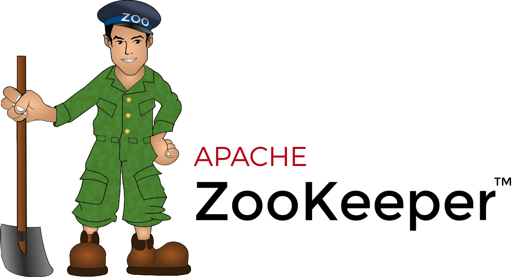
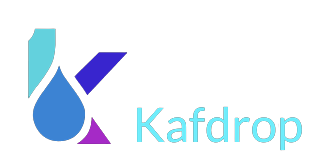
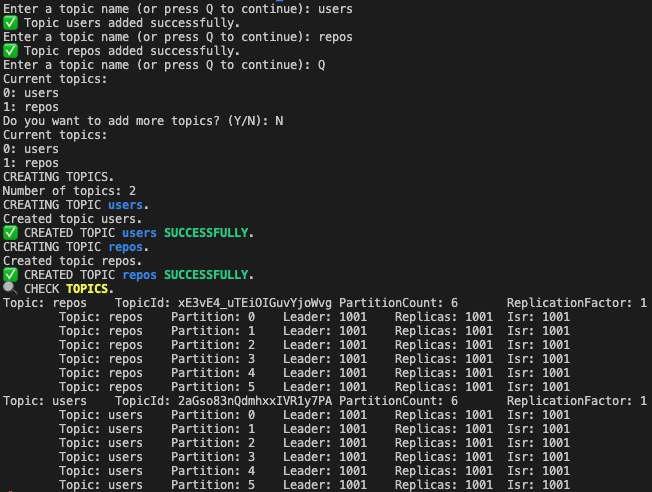
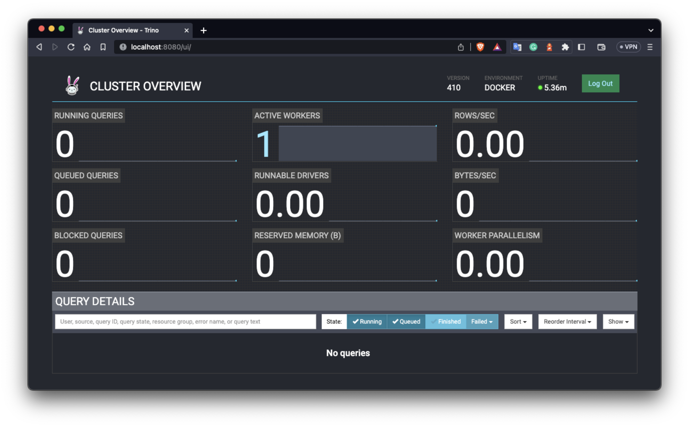
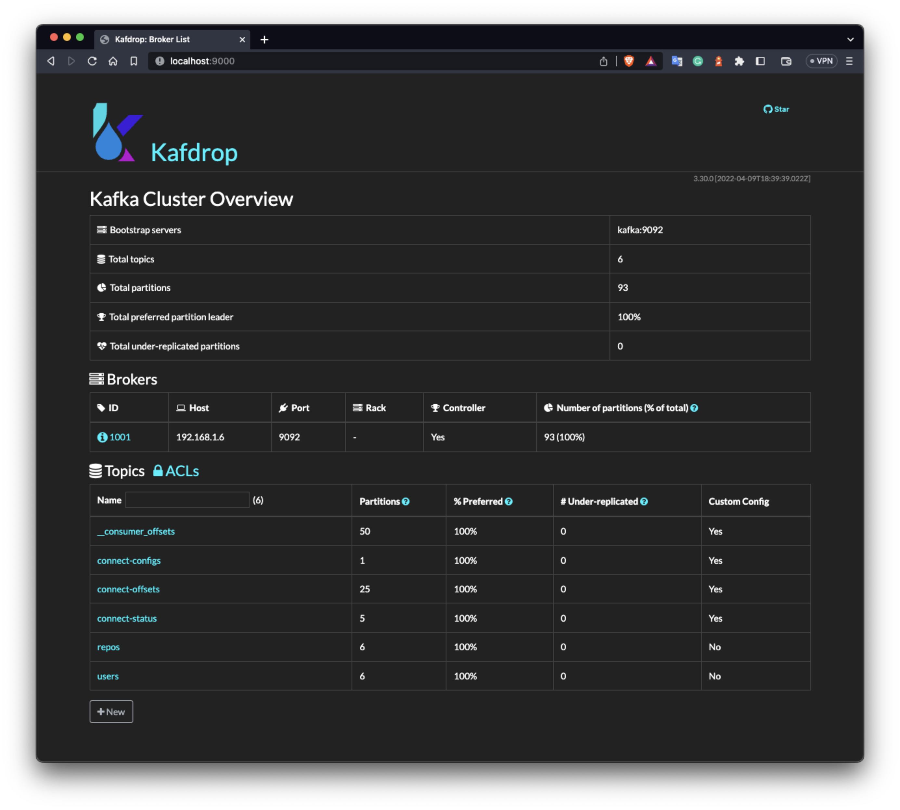
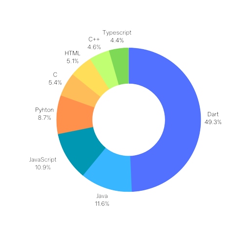
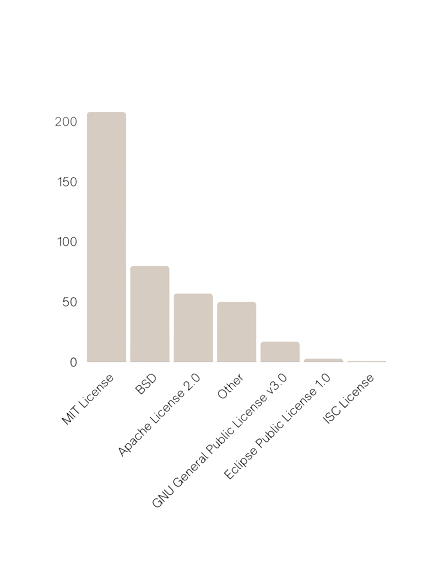

# TrinoDB

## 📊 About the Project

This repository is related to an University project for a course called "Technology for Big Data Management" (TBDM). The main goal of the project was to analyse and study the potential of using Kafka Broker and TrinoDB to analyse real time data streaming.

The objective of the project is to define a prototype tool to analyse data in real time by using trino [Trino](https://prestodb.io/). Below it is reported the implemented architecture where Apache Kafka [Kafka](https://kafka.apache.org/) can be used for reading real time messages to be stored in MongoDB by using a standard Kafka connector. Trino allow to connect to MongoDB on one side, on the other side express the analytics via standard SQL queries.

The implemented system for the project is composed of a docker-compose file where all the necessary images are configured, such as Zookeeper, Kafka, MongoDB, Mongo-Express, Kafdrop, and TrinoDB. The docker-compose file sets up the environment required for testing the connection between Kafka, MongoDB, and TrinoDB locally.

In addition to the docker-compose file, the repository contains a bash script called [run.sh](http://run.sh/) that automatically creates and sets up the environment for testing the connection between Kafka, MongoDB, and TrinoDB locally through a docker container.

## ⚙️System Components

The following components are included in the system:

- **Kafka**: is a distributed streaming platform that is used for building real-time data pipelines and streaming applications. It is designed to handle high volumes of data and provide low latency data delivery. Kafka allows for the creation of data streams that can be processed and analyzed in real-time. It is commonly used for log aggregation, clickstream analysis, fraud detection, and other real-time data processing tasks. In the TrinoDB project described in this document, Kafka is used as a messaging system for reading real-time messages to be stored in MongoDB by using a standard Kafka connector.

- **Zookeeper**: is a distributed coordination service that is used to maintain configuration information, provide distributed synchronisation, and provide group services. It provides a centralised service for maintaining configuration information, naming, providing distributed synchronisation, and providing group services. ZooKeeper is used by many distributed systems to manage configuration information, maintain distributed state, and provide leadership election. In the context of the TrinoDB project described in this document, ZooKeeper is included as a component in the system architecture implemented in the project. It is used to manage the Kafka cluster and ensure that the data is replicated across all nodes in the cluster.

- **MongoDB**: is a cross-platform document-oriented NoSQL database program. It is classified as a NoSQL database program because it does not rely on a traditional table-based relational database structure. Instead, it uses a document-based model to store data in flexible, semi-structured JSON-like documents, making it easier and faster to manage and access data. MongoDB was designed to be scalable, performant, and easy to develop with, making it a popular choice for modern web applications and big data systems.

- **Mongo-Express**: is a web-based MongoDB administration tool that provides a user-friendly interface for managing MongoDB databases. It allows you to view, edit, and delete data, as well as create and manage users and indexes. In the context of the TrinoDB project described in this document, Mongo-Express is included as a component in the system architecture implemented in the project. The Mongo-Express web interface is exposed on port `8081`.

- **Kafdrop**: is a web-based Kafka UI that allows you to explore Kafka topics and consumer groups. It provides a user-friendly interface for monitoring Kafka topics and messages, as well as managing consumer groups. In the context of the TrinoDB project described in this document, Kafdrop is included as a component in the system architecture implemented in the project. The Kafdrop web interface is exposed on port `9000`. Here you can find all the information about Kafka broker and all the previously created topics.

- **TrinoDB**: is a distributed SQL query engine designed to query data from multiple sources. It was formerly known as PrestoDB. TrinoDB allows users to query data from various data sources such as Hive, Cassandra, and MongoDB using a single SQL query. It is optimized for running ad-hoc queries on large data sets and is particularly useful for analyzing real-time streaming data. In the context of the project described in this document, TrinoDB was used to connect to MongoDB on one side and express the analytics via standard SQL queries on the other side. TrinoDB is included as a component in the system architecture implemented in the project.

- **Jupyter Notebook**: is an open-source web application that allows for the creation and sharing of documents that contain live code, equations, visualizations, and narrative text. It supports various programming languages including Python, R, and Julia, among others. The notebook interface combines code, results, and markdown text in a single editable document, making it a popular tool for data analysis, data visualization, machine learning, and scientific computing. Jupyter Notebook is widely used in academia, industry, and government for research, education, and collaboration.

## 🆕 Get Started

### Prerequisites

- [Node & NPM](https://nodejs.org/en)
- [Docker](https://www.docker.com/)
- [Python3 & pip](https://www.python.org/)

### Installation

To use the system, follow these steps:

1. Clone this repository to your local machine. You can do this by using the `git clone` command on your terminal or by downloading the repository as a zip file and extracting it to your desired directory.

2. `git clone https://github.com/Michele-x98/TBDM-TrinoDB`

3. Once you have the repository on your local machine, navigate to the cloned directory. You can do this by opening your terminal and using the `cd` command followed by the path to the repository.

4. `cd TBDM-TrinoDB`

5. Make the `run.sh` script executable by applying the command `chmod +x run.sh` and run the script located in the root directory of the repository. This script will set up the necessary environment for the system to run.

6. `./run.sh`

7. Type the number and names of topics that you want to create over the terminal when asked.

You can create as much topic as you want during the setup script (at least one) and then wait until everything is set up.
Once the environment is set up, you can access different web interface in order to check that everything is working properly:

- The **TrinoDB** web interface is exposed on port `8080`.

- The **Mongo-Express** web interface is exposed on port `8081`.

- The **Kafdrop** web interface is exposed on port `9000` where you’ll find all the information about Kafka broker and all the previously created topics.

### Data Transfer and Visualization

1. To start the Kafka producer, navigate to the `KafkaProducer` folder.

Once you have done so, you can run the command `npm install` and then `node index.js` to start the producer. The `node index.js` command will start the producer server and begin sending messages to the configured Kafka topic.

2. A Jupyter Notebook file with all the necessary configurations is included in the `Jupyter` folder of the cloned repository. You can copy this file to your local machine and run it to connect to the TrinoDB query engine and query the MongoDB database. The notebook file is already configured with the correct settings and requires no additional setup. Simply open the file, run the cells, and start analysing your data!

    ### **Python libraries**

    - **Pandas**: is a popular open-source data analysis and manipulation library for Python3. It provides data structures for efficiently storing and manipulating large and complex datasets, as well as tools for data analysis, cleaning, and transformation. Pandas is commonly used in data science, finance, social science, and many other fields.
    - **Trino**: a Trino client for the Python3 programming language.
    - **Plotly**: is a data visualization library that allows you to create interactive charts and graphs. It provides a variety of chart types, including scatter plots, line charts, bar charts, and more. Plotly is used in data science, business intelligence, and many other fields where data visualization is important.

By following these steps, you will be able to use the system without any issues. If you encounter any problems, feel free to consult the documentation or seek help from the support team.

## **Results**

Here are some results of the queries made through TrinoDB and visualized via Jupyter notebook about the most used language and most used licence of repositories:

 

## **Acknowledgments**

This project was developed as part of the course "Technologies for Big Data Management" at the University of Camerino by:

- [Michele Benedetti](https://github.com/Michele-x98)

- [Flavio Pocari](https://github.com/flaviopopoff)

- [Armando Xheka](https://github.com/ArmandoXheka)

## Conclusion

This project demonstrates the potential of using Kafka Broker and TrinoDB for managing and analysing big data. By using the implemented system, users can easily set up an environment for testing the connection between Kafka, MongoDB, and TrinoDB. Although, a simple producer is included in the project in order to demostrate the complete flow of the application from when the data are produced to when the data are analysed through Jupyter.
